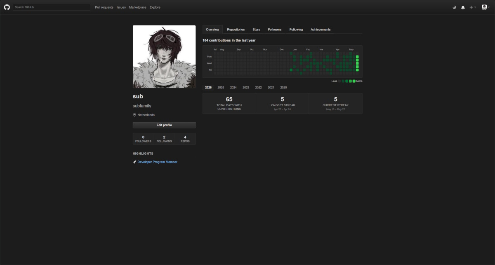
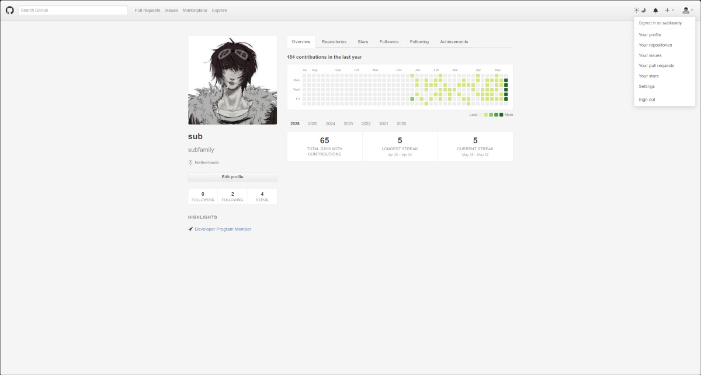

# OldGitHub

The 2012–2013 GitHub layout, rebuilt as a Chrome extension.

<p align="center">
  
  
</p>

Re-skins `github.com` (and the gist subdomain header) in the classic 2013 interface, light and dark. Reuses your existing session cookie — no PAT, no OAuth, no hosted infra.

## Install

Once published, link from the Chrome Web Store will go here. Until then:

```sh
npm install && npm run build
```

Load `dist/` in Chrome via `chrome://extensions` → "Load unpacked".

## Themed

Dashboard, profile, repos (home/tree/blob/commits/issues/PRs/wiki/releases/actions/projects/security/insights/settings), notifications, search, explore, trending, topics, collections, sponsors browse, user and repo settings, hovercards.

Pages that are React-only forms (`/new`, `/import`, `/login`, `/signup`, create-issue / create-discussion / create-release / fork dialog) and embedded vendor surfaces (Codespaces, Copilot) keep the 2013 header on top and let GitHub's native body render below — so submit flows still work.

## Develop

```sh
npm run dev          # vite watch into dist/
npm run typecheck    # tsc --noEmit
npm run pack         # zip dist/ for store upload
```

The dev build adds `http://localhost:7878/*` plus a background poller that reloads the extension on rebuild. `npm run build` strips both.

## License

MIT.
